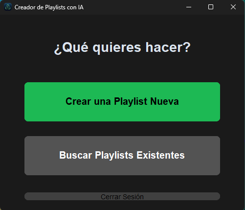
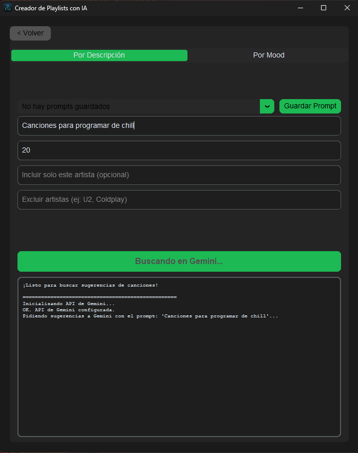
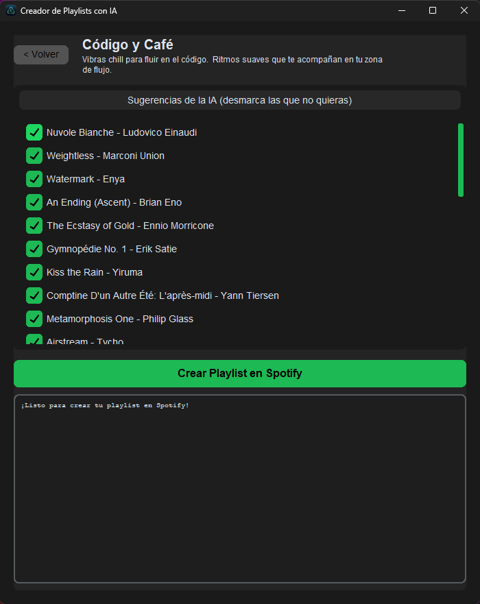

# AI Playlist Creator 🎶

**De palabras e ideas → a playlists únicas en Spotify. Powered by AI.**  

> ⚠️ Nota: Actualmente la aplicación está en **fase Beta**. Por limitaciones de la API de Spotify, solo usuarios invitados por el desarrollador pueden usarla. Próximamente estará disponible públicamente.

---

## Registro Beta Privada – Creador de Playlists con IA

¡Gracias por tu interés en probar la beta privada de nuestra aplicación! 🎶

Para unirte, sigue estos pasos:

Accede al formulario de registro aquí: [Formulario de Beta Privada](https://docs.google.com/forms/d/e/1FAIpQLSfgpnjuWvyIUXto5p1ZszkMx_YBGYHfjz7NTboTo28-Szm47g/viewform?usp=dialog)

Completa tus datos correctamente y envía el formulario.

Una vez registrado, recibirás confirmación por correo (o se añadirá tu usuario a nuestra lista interna).

A partir de ahí, recibirás acceso a la beta privada y podrás probar todas las funciones antes del lanzamiento oficial.

⚠️ Nota: Esta beta es privada y limitada, solo los usuarios registrados podrán acceder a ella.

¡Gracias por ayudarnos a mejorar Creador de Playlists con IA! 🙌

---

## 🚀 Cómo Empezar (Guía para Usuarios)
Para usar la aplicación, solo necesitas descargar el ejecutable y conseguir una clave de API gratuita de Google.

Paso 1: Descargar la Aplicación

Ve a la sección de "Releases" en la parte derecha de esta página de GitHub.
Descarga el archivo AI.Playlist.Creator.exe de la última versión.
Guarda el archivo en una carpeta en tu ordenador. ¡No requiere instalación!

Paso 2: Obtener tu API Key de Google Gemini

La IA necesita esta clave para funcionar. Es gratuita y fácil de obtener.

Accede a [Google AI Studio](https://aistudio.google.com/app/u/2/apikey?pli=1).

Inicia sesión con tu cuenta de Google.

Haz clic en "Create API key" y copia la clave que se genera.

⚠️ Importante: Tu clave de API es secreta. No la compartas con nadie.

Paso 3: Primer Arranque y Configuración

Ejecuta AI Playlist Creator.exe.

Aparecerá la ventana de "Configuración Inicial".

Pega tu API Key de Gemini en el primer campo.

Haz clic en el botón "Iniciar Sesión con Spotify". Se abrirá una ventana de tu navegador para que autorices la aplicación.

¡Y ya está! La aplicación guardará tus claves de forma segura para las próximas veces.

---

## 🚀 Qué es AI Playlist Creator

AI Playlist Creator es una aplicación de escritorio para Windows que permite crear playlists personalizadas en Spotify a partir de **descripciones en lenguaje natural** o **estados de ánimo**.  
Con la potencia de **Google Gemini** y la integración de **Spotify Web API**, puedes generar playlists únicas y listas para escuchar en segundos.

---

## ✨ Funcionalidades principales

- **Creación de playlists asistida por IA**  
  - Entrada de prompt flexible: por descripción o por mood.  
  - Generación de nombre y descripción creativos para cada playlist.  
  - Filtros avanzados: incluir o excluir artistas.  
  - Refinamiento interactivo: selecciona qué canciones quieres incluir antes de crear la playlist.

- **Búsqueda de playlists públicas**  
  - Busca playlists existentes en Spotify usando palabras clave.  
  - Resultados con enlaces directos a Spotify.

- **Gestión de prompts favoritos**  
  - Guarda y carga tus prompts favoritos para reutilizarlos fácilmente.

- **Experiencia de usuario robusta**  
  - Autenticación segura con OAuth 2.0.  
  - Interfaz gráfica fluida con **CustomTkinter**.  
  - Operaciones asincrónicas para que la app nunca se congele.  
  - Manejo de errores inteligente (conexión, claves, respuestas inesperadas de la IA).

---

## ⚙️ Uso

Descarga el **.exe** de la última versión en la sección de [Releases]([https://github.com/TUUSUARIO/AI-Playlist-Creator/releases](https://github.com/Elgeryy1/AI-Playlist-Creator/releases)) y ejecútalo directamente en Windows.  

> Nota: Actualmente solo usuarios invitados pueden iniciar sesión en Spotify por limitaciones de la API.

---

## 🎯 Roadmap / Próximas versiones

- Acceso público completo a Spotify API.  
- Mejoras en la UI y experiencia de refinamiento.  
- Opciones avanzadas de personalización de playlists.  
- Integración con otras plataformas de música.

---

## 🤝 Contribuciones

Si quieres contribuir:  
- Haz un fork del repo.  
- Crea una rama nueva con tus cambios (`git checkout -b mi-rama`).  
- Haz commit de tus cambios (`git commit -m "Mi mejora"`).  
- Envía un pull request.

> Por favor respeta las reglas de crédito y autoría si modificas la app.  

---

## 📄 Licencia

Actualmente bajo **Licencia Personalizada / GPLv3**.  
- Se permite usar y modificar el software.  
- Si redistribuyes o subes modificaciones, debes dar crédito al autor original (Gerard / AI Playlist Creator).  
- Este software se proporciona “tal cual”, sin garantía de ningún tipo.

---

## 🖥️ Capturas de pantalla

